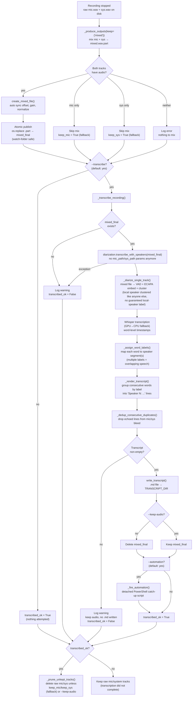

```mermaid
flowchart TD
    A["Recording stopped\nraw mic.wav + sys.wav on disk"] --> B["_produce_outputs(keep={'mixed'})\nmix mic + sys → mixed.wav.part"]
    B --> C{"Both tracks\nhave audio?"}
    C -- "yes" --> D["create_mixed_file()\nauto sync offset, gain, normalize"]
    C -- "mic only" --> E["Skip mix\nkeep_mic = True (fallback)"]
    C -- "sys only" --> F["Skip mix\nkeep_sys = True (fallback)"]
    C -- "neither" --> G["Log error\nnothing to mix"]

    D --> H["Atomic publish\nos.replace .part → mixed_final\n(watch-folder safe)"]

    H --> I{"--transcribe?\n(default: yes)"}
    E --> I
    F --> I
    G --> I

    I -- "no" --> OK1["transcribed_ok = True\n(nothing attempted)"]
    I -- "yes" --> J["_transcribe_recording()"]

    J --> J0{"mixed_final\nexists?"}
    J0 -- "no" --> FAIL["Log warning\ntranscribed_ok = False"]
    J0 -- "yes" --> K["diarization.transcribe_with_speakers(mixed_final)\nno mic_path/sys_path params anymore"]

    K -- "exception" --> FAIL
    K --> N["_diarize_single_track()\nmixed file → VAD + ECAPA embed + cluster\n(local speaker clustered like anyone else,\nno guaranteed local-speaker label)"]

    N --> O["Whisper transcription\n(GPU→CPU fallback)\nword-level timestamps"]

    O --> Q["_assign_word_labels()\nmap each word to speaker segment(s)\n(multiple labels = overlapping speech)"]
    Q --> R["_render_transcript()\ngroup consecutive words by label\ninto 'Speaker N: ...' lines"]
    R --> S["_dedup_consecutive_duplicates()\ndrop echoed lines from mic/sys bleed"]

    S --> T{"Transcript\nnon-empty?"}
    T -- "no" --> FAIL2["Log warning\nkeep audio, no .md written\ntranscribed_ok = False"]
    T -- "yes" --> V["write_transcript()\n.md file → TRANSCRIPT_DIR"]

    V --> W{"--keep-audio?"}
    W -- "no" --> X["Delete mixed_final"]
    W -- "yes" --> Y["Keep mixed_final"]

    X --> AA["--automation?\n(default: yes)"]
    Y --> AA
    AA -- "yes" --> AB["_fire_automation()\ndetached PowerShell catch-up script"]
    AA -- "no" --> OK2["transcribed_ok = True"]
    AB --> OK2

    OK1 --> P{"transcribed_ok?"}
    OK2 --> P
    FAIL --> P
    FAIL2 --> P

    P -- "yes" --> PR["_prune_unkept_tracks()\ndelete raw mic/sys unless\nkeep_mic/keep_sys (fallback) or --keep-audio"]
    P -- "no" --> KEEP["Keep raw mic/system tracks\n(transcription did not complete)"]
```
